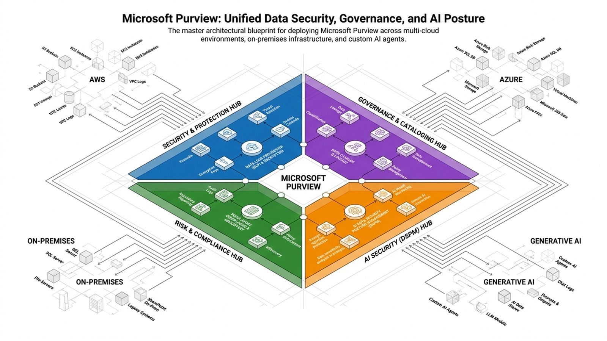

# Learn Purview



An architecture deep dive on Microsoft Purview, built as a study console for enterprise architects: conceptual, logical, and physical views, third-party integrations, the AI data path, and a TOGAF / DoDAF lens. It uses the same no-build framework as [learn-ai-law](https://github.com/aaronmeis/learn-ai-law), including its engagement layer.

**Live:** https://aaronmeis.github.io/learn-purview/

Every claim traces to a 36-row source ledger restricted to Microsoft Learn, Microsoft service descriptions, Microsoft reference architectures, and Microsoft Mechanics. NotebookLM media and reports are included as secondary material, with their known errors called out.

## What's here

- **Today:** the landing page. A **daily architecture challenge** in three rounds, the same for everyone on a given date:
  1. The question of the day, from the deep-dive cut's 14 question cards.
  2. Spot the fix: a failure-mode symptom and three candidate mitigations.
  3. A placement drill: where a component runs, how a connector authenticates, or which architecture view a detail belongs to.

  The page also has a day streak, goal rings (challenge, one Short, five reviews), a 7-day chart, and a copyable score line.
- **Learn:** the 8-block curriculum (about 7 hours) with the scope mind map, the architecture views (with diagrams and the government cloud matrix), Shorts, the deck and deep-dive cut (each slide with its narration and question card), and the library.
- **Practice:** flashcards (39 terms), the 30-question design-review quiz, 20 failure modes, and prompts.
- **Reference:** decision rules, progress map, glossary, EA mapping, source ledger, overview.
- **Shorts:** watched tracking, a "check yourself" panel of linked questions and terms, keyboard shortcuts (J/K/Q), and a swipeable vertical feed on phones.
- **Everywhere:** Ctrl+K search (views, terms, failure modes, notes, sources), mobile tab bar, offline support, progress export/import.
- `library/`: 41 HTML pages rendered from the Obsidian pack and the NotebookLM exports. These include the hub, mission, scope interview, day plan, views, blocks, glossary, cheatsheet, quiz bank, source ledger, prompt notes, and reports. `[S#]` citations link to the source, and Mermaid diagrams render in the browser.

## Layout

```
index.html            page shell (nav, mobile chrome, sections)
css/base.css          theme tokens and base styles
css/enhance.css       engagement layer and daily challenge styles
js/data.js            sources, curriculum, quiz, glossary, failure modes, drills, cut script
js/app.js             view renderers
js/enhance.js         routing, Today and daily challenge, Shorts, search, export, offline
shorts-catalog.js     generated by scripts/stage_assets.py
library/              generated by scripts/build_library.py
sw.js, manifest.webmanifest   offline support and install metadata
```

Saved progress uses the `lp:` key prefix, because learn-ai-law shares the same github.io origin.

## Rebuilding from the vault

The Obsidian pack at `Learning/tech-deep-dive/microsoft-purview/` is the source of truth. After editing it or regenerating the NotebookLM suite:

```
python scripts/stage_assets.py          # media, posters, durations, icons, shorts catalog (--force to overwrite)
python scripts/build_library.py         # re-render library/*.html and library/manifest.js
```

Videos play from YouTube (unlisted) when an ID is set in the `YOUTUBE` map at the top of `scripts/stage_assets.py`. If YouTube can't play a video (private, removed, or blocked), the local MP4 in `media/` plays instead. Re-run `stage_assets.py` after editing the map.

Requires Python with `markdown`, `pyyaml`, and `Pillow`, plus `ffmpeg` on PATH. The deep-dive cut script in `js/data.js` (`DATA.cut`) comes from the vault's `video/cut-script.json`.

## Running locally

```
python -m http.server 8765
```

Study material only. Check licensing and government cloud availability against current Microsoft documentation before relying on it.
